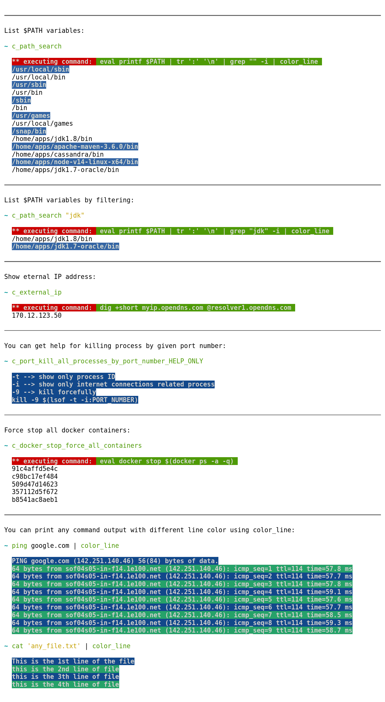

# CC_SCRIPTS

# ABOUT PROJECT

Multi-purpose shell functions.

All these functions are wrapper functions (they only call other commands like grep, cat, curl, ipconfig which available on your local machine). Some example functions can be seen below.

# EXAMPLE FUNCTIONS

All other scripts are categorized under [src](./src) directory.

# DOCUMENTATION

All documentations are inside [documentation](./documentation) directory.

# OPTIONAL PARAMETERS

Change HOME directory for standalone apps (like Flatpak does):

> CC_APPS_HOME="/run/media/user1/internal1/HOME"

Standalone apps:

> CC_STANDALONE_APPS_PATH_ROOT="/run/media/user1/internal1/EXTRACTED_APPS"

Add above parameters before source it:

> source "$HOME/cc_scripts/release/cc_scripts.sh"
